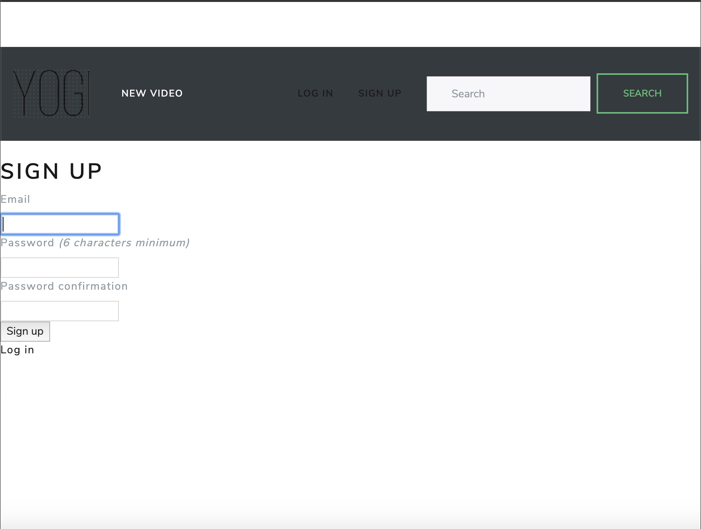
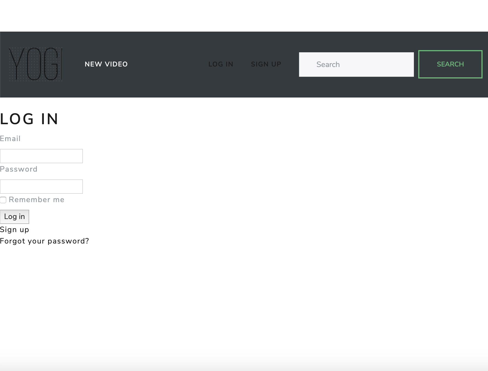
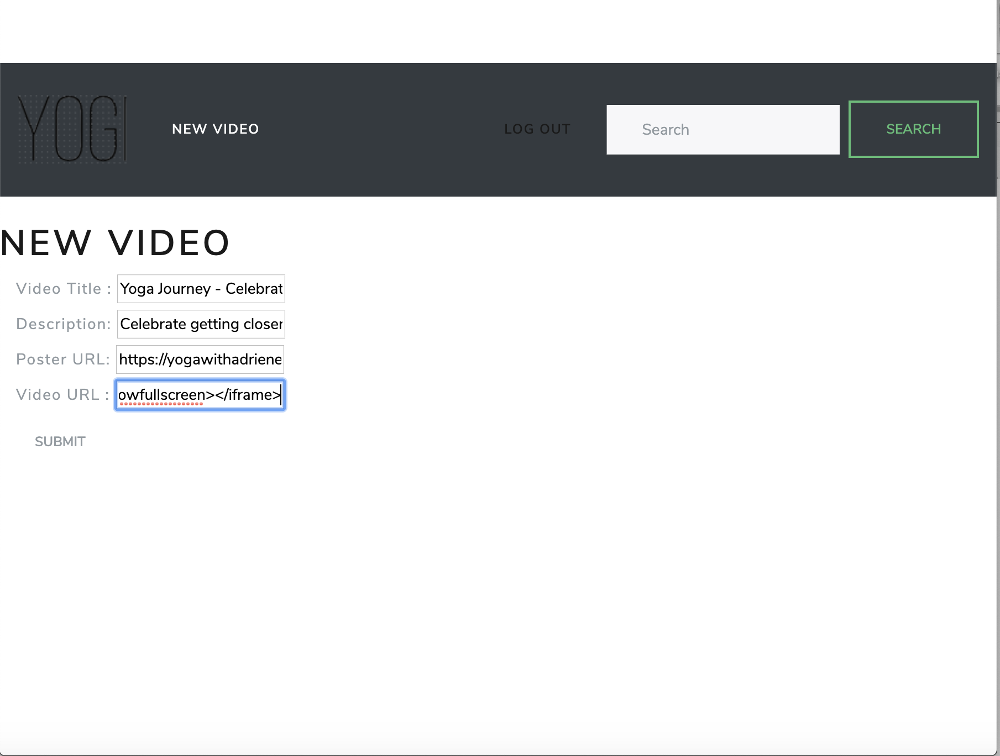
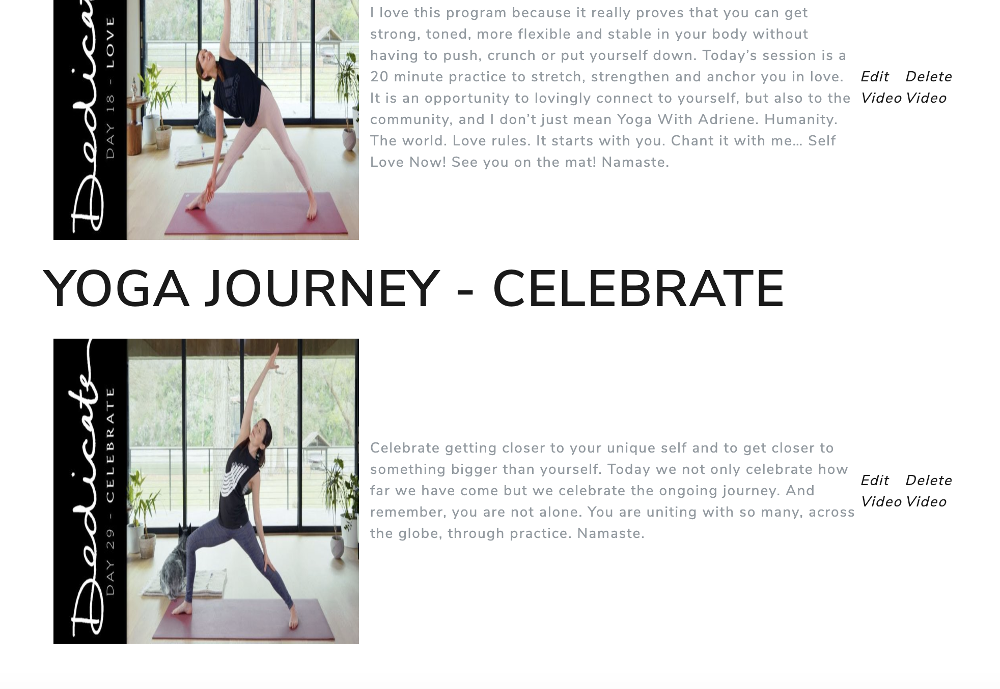
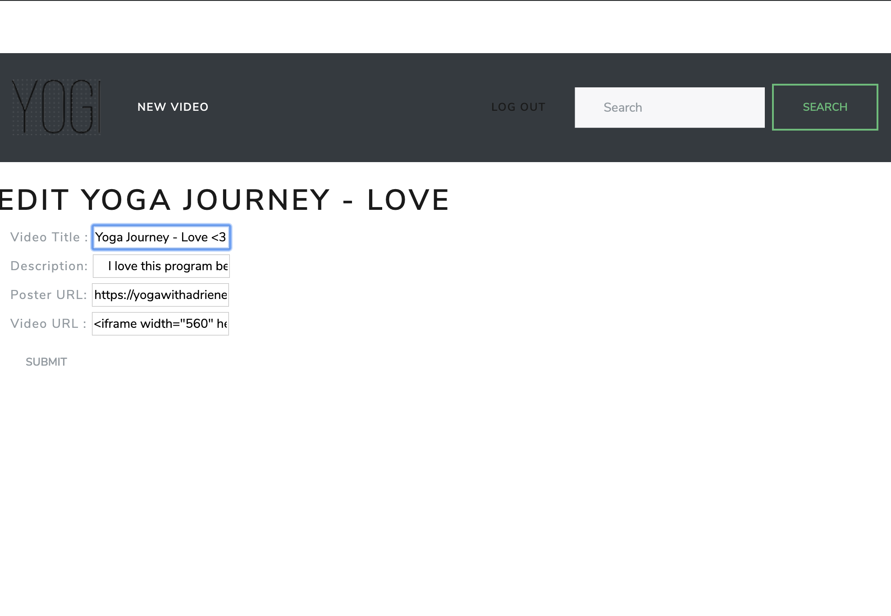
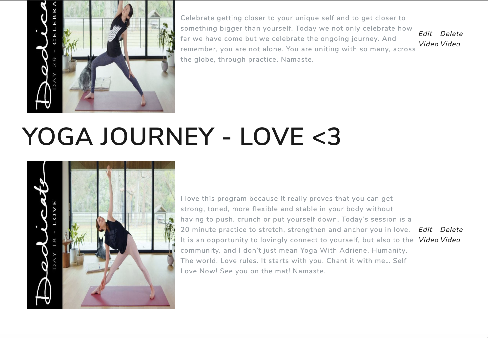
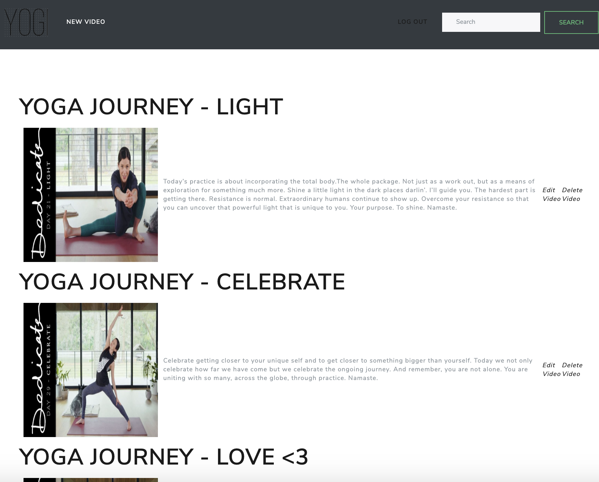
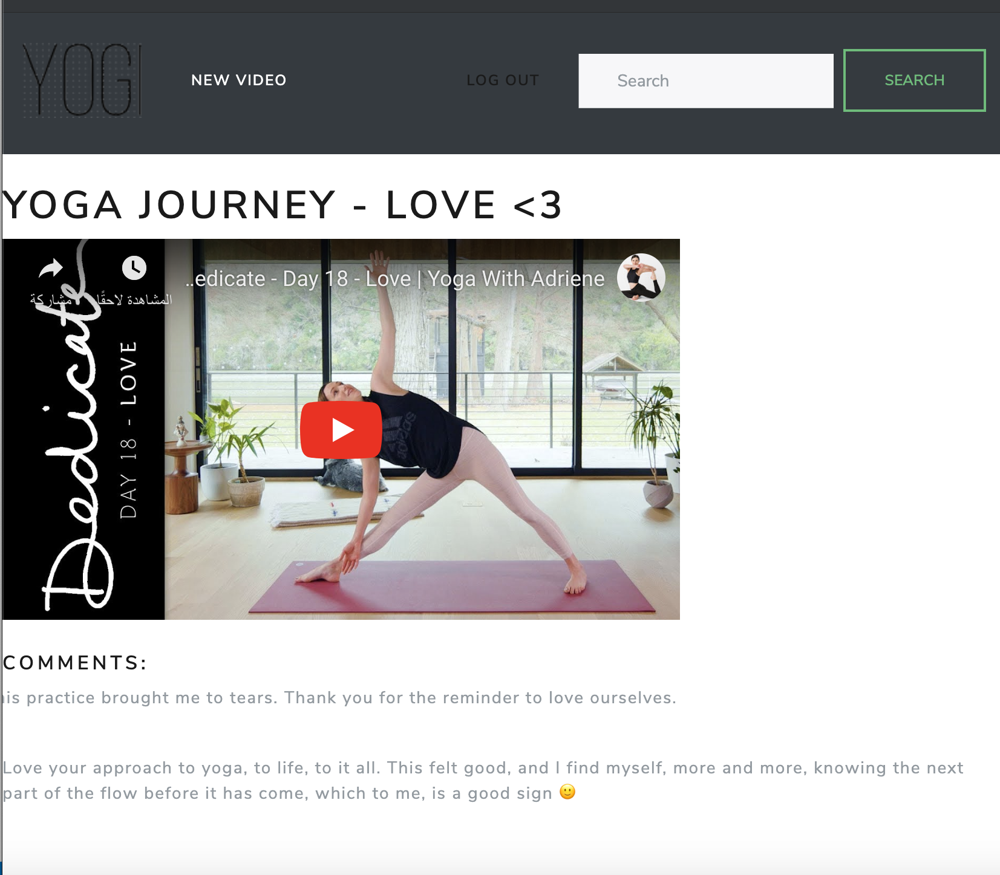
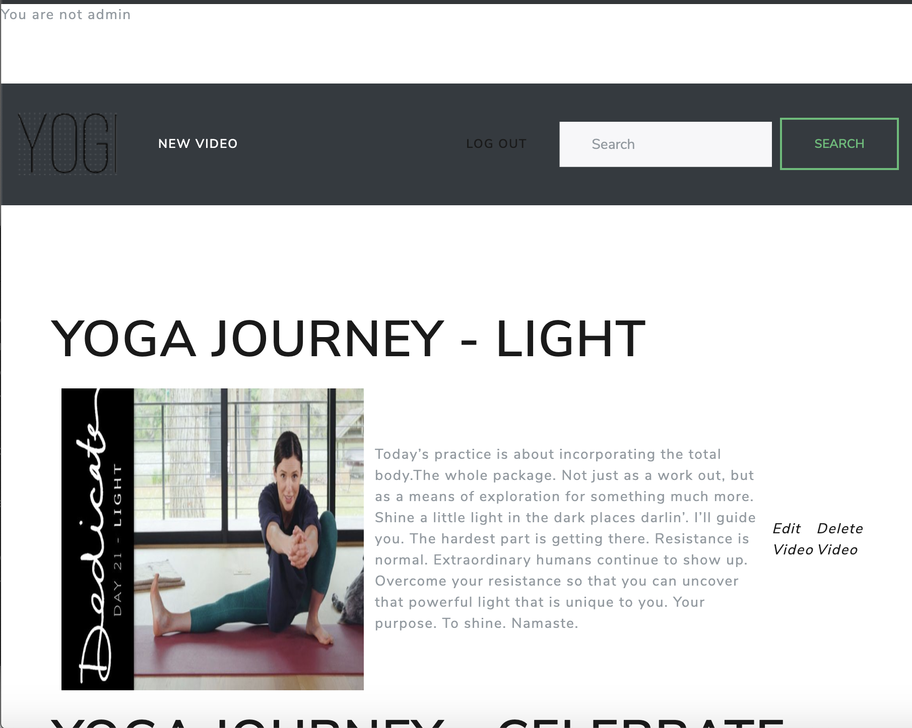
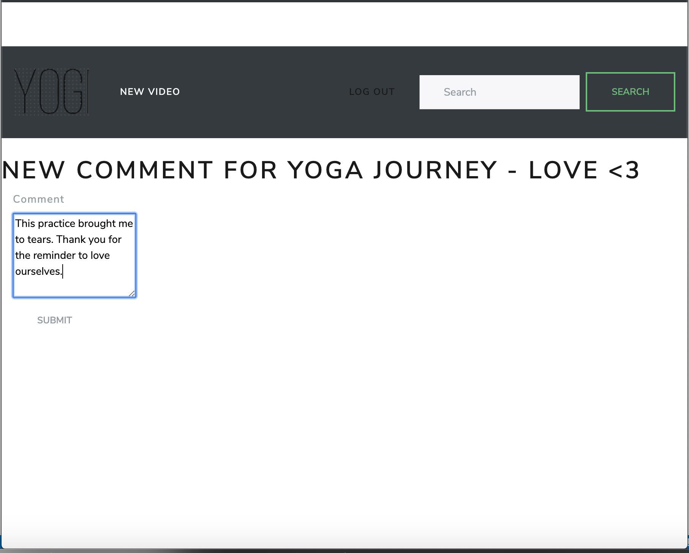

#  Yoga Community App
I created a full stack application using Ruby on Rails and Postgresql for Yoga Community App. I believe that yoga is for everyone and I want all practitioners from beginners to masters to share the journey of yoga and enJOY it with all people around the world.

## - User sign up

## - User log in

## - Admin create a video

## - Admin create a video

## - Admin edit a video

## - User view all videos

## - User view single video

## - User not be able to edit or delete or create videos 

## - User add comment 

## Author

Aesha Alshuraim – aishaalshuraim@gmail.com

